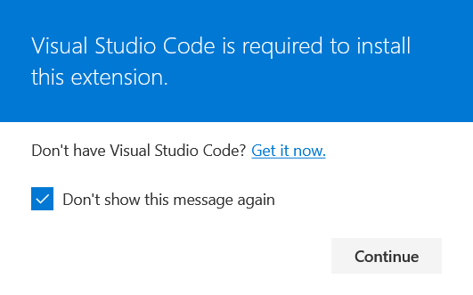

Data packs can be created using any text editor, such as *Notepad* or *Sublime Text*. However, it is much nicer to use software with proper syntax highlighting
and custom file icons. In this chapter you will set up *Visual Studio Code* for work with Minecraft data packs by using specialised extensions made by other data
pack developers. If you wish to use a different text editor, feel free to [skip](#up-next) this chapter.

## Installing *Visual Studio Code*
Installing *Visual Studio Code* from the official website is really easy and can be done in 4 simple steps:
1. Go to the [official download page](https://code.visualstudio.com/download)
2. Download the installer for your OS (it should be highlighted)
3. Run the installer
4. It will guide you through the installation process. The default values should be fine, though feel free to tweak them if you want.

## Installing the necessary extensions
One feature of *VS Code* is its expandability using *extensions*. There are two main ones used for datapack development:
- **[Datapack Helper Plus by Spyglass](https://marketplace.visualstudio.com/items?itemName=SPGoding.datapack-language-server)** for syntax highlighting and auto
completion
- **[Datapack Icons](https://marketplace.visualstudio.com/items?itemName=SuperAnt.mc-dp-icons)** for custom icons for data pack files

To install them, follow these steps:
1. Follow the links above to the *Visual Studio Marketplace*
2. Press the **Install** button
3. If the website shows a popup (see fig. 2.1), click **Continue**
4. If your browser asks you for permission to open *VS Code*, accept by clicking **Open link** or a similar button

**Alternatively**, you can open the **Extensions** tab in *VS Code* (or press Ctrl+Shift+X), search for the extensions and press **Install**.

fig. 2.1

**NOTE:** When installing *Datapack Icons*, you will be prompted to select a file icon theme. Select *Datapack Icons Theme*

With that, your work environment should be fully set up for data pack development. In the next chapter, you will learn how to create your first data pack and what
the basic structure of one is.

### Up next: [Chapter 3. Your First Data Pack](03.md)
